# 🎬 Junior Reels

**Junior Reels** is a kid-friendly movie and short-film discovery web application designed to help children and parents explore safe, age-appropriate, and educational animated content.

The platform combines a playful, child-centric frontend with a Node.js backend that handles API communication and prepares the project for future scalability, authentication, and data management.

---

## 🌟 Project Vision

Children’s entertainment platforms should be:

- 🛡️ Safe and age-appropriate  
- 🎨 Visually engaging yet simple  
- 🧭 Easy to navigate for both kids and parents  

**Junior Reels** aims to meet all three goals while showcasing full-stack web development fundamentals.

---

## ✨ Current Features

- 🎨 Kid-friendly UI with soft gradients and playful typography  
- 🔍 Search functionality for cartoons and animated movies  
- 🎬 Featured Movies section with dynamic content  
- 🧩 Movie cards displaying poster, title, and release year  
- 📂 Categorized sections:
  - Trending Cartoons
  - Educational Fun
  - Bedtime Stories
- 🔗 Real-time movie data fetched via backend using the **OMDb API**
- 📱 Responsive layout across devices  

---

## 🛡️ Child Safety & Content Awareness

Junior Reels includes a unique **“Is this safe for me?”** feature to support responsible viewing.

Each movie is assigned a **Junior Reels Safety Score**, derived from:

- Official age rating  
- Genre and thematic elements  
- Indicators of violence or strong language  
- Educational and moral value  

Safety information is presented in a simple, friendly format so that:

- 👧 Children can understand suitability  
- 👨‍👩‍👧 Parents can make confident decisions  

---

## 🛠️ Tech Stack

### Frontend
- HTML5 – semantic structure  
- CSS3 – custom styling, gradients, hover effects  
- JavaScript (Vanilla) – dynamic rendering and UI logic  

### Backend
- Node.js – server-side runtime  
- Express.js – API routing and request handling  

### APIs & Assets
- OMDb API – real movie metadata  
- Google Fonts – Schoolbell, Snippet  
- Font Awesome – icons  

---

## 🧱 System Architecture (High Level)

Frontend (HTML / CSS / JS)  
↓  
HTTP Requests  
↓  
Node.js + Express Backend  
↓  
OMDb API  

- Frontend requests movie data from the backend  
- Backend securely communicates with the OMDb API  
- API keys are not exposed on the client side  
- Architecture supports future features like authentication and databases  

---

## 📸 Screenshots

### Home Page
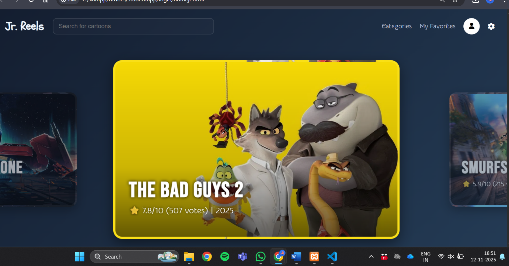

### Movie Cards
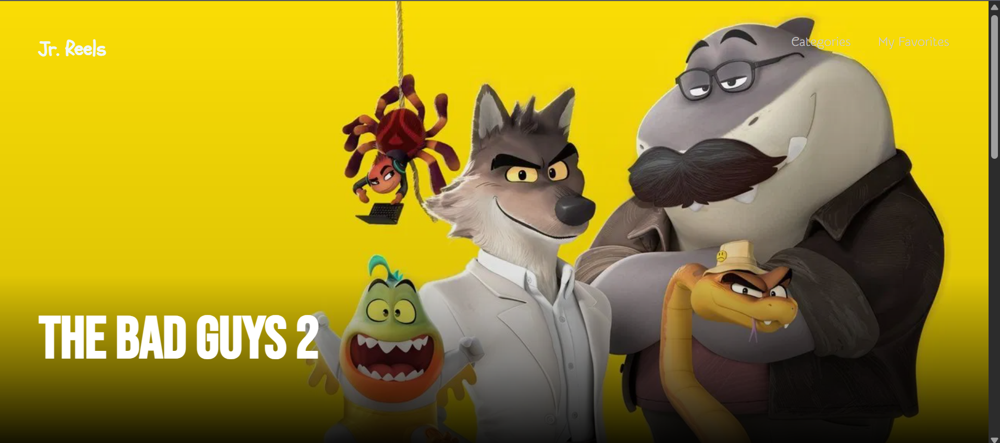  
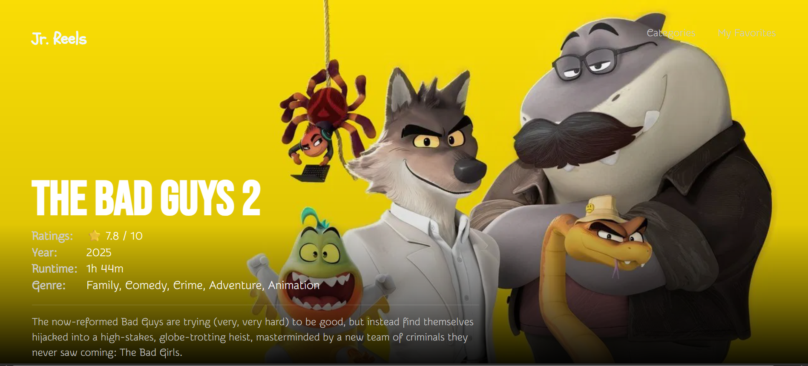  
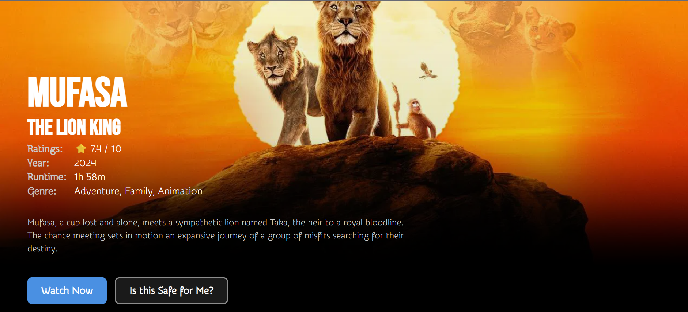  
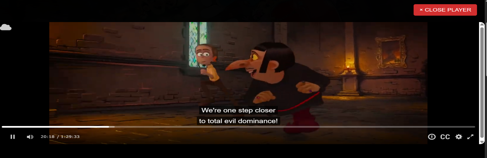  
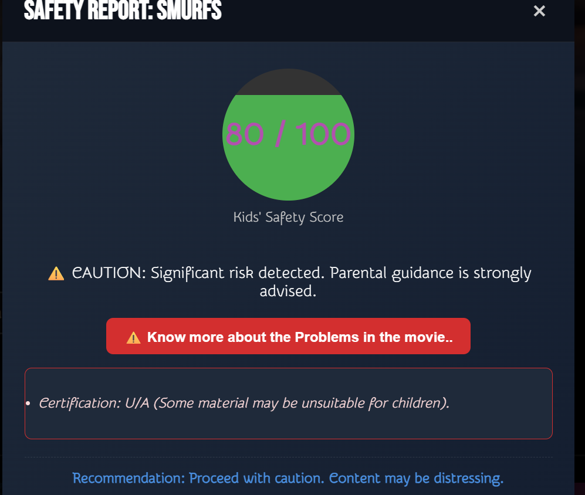  
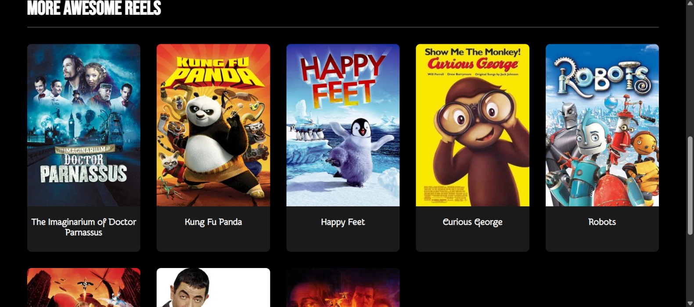

### Categories Page
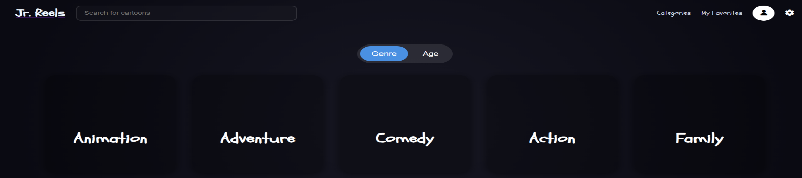  
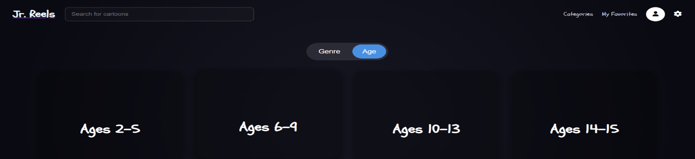  
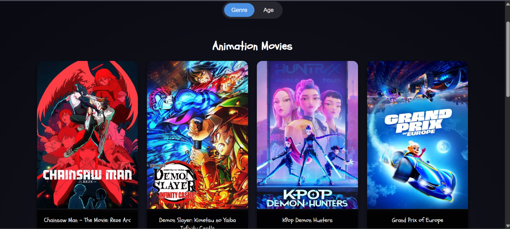  
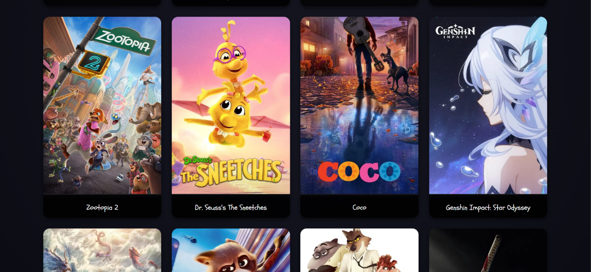

### Search Feature


---

## ⚙️ Installation & Setup

### Prerequisites
- Node.js (v18+ recommended)
- npm

### Steps

1. Clone the repository:
   ```bash
   git clone https://github.com/your-username/junior-reels.git
2. Navigate into the project:
   ```bash
   cd junior-reels
3. Install backend dependencies:
   ```bash
   npm install
4. Create a .env file and add your API key:
   ```bash
   OMDB_API_KEY=your_api_key_here
5. Start the backend server:
   ```bash
   npm start
6. Open the frontend in your browser:
   ```bash
   index.html
## 🧠 Design & Development Decisions

- Backend abstraction prevents exposing API keys  
- Express routes keep API logic centralized  
- Vanilla JS frontend strengthens core JavaScript skills  
- Modular layout supports easy feature expansion  
- Designed for gradual transition to a full MERN-style stack  

---

## 🔮 Roadmap (Planned Enhancements)

- 👤 Parent & child user profiles  
- ❤️ Watchlist and favorites  
- 🎯 Age-based content filtering  
- 📊 Improved safety scoring algorithm  
- 🔐 Authentication & authorization  
- 🗄️ Database integration (MongoDB)  
- 🌐 Full deployment (frontend + backend)  

---

## 🤝 Contribution & Project Status

This project is independently developed and actively evolving.

Feedback and suggestions are welcome.  
Collaboration guidelines may be added in later stages.

---

## 👩‍💻 Author

**Rishika Venugopal**  
Frontend & Backend Web Developer (Student)  
Project built independently as part of a full-stack development portfolio.

